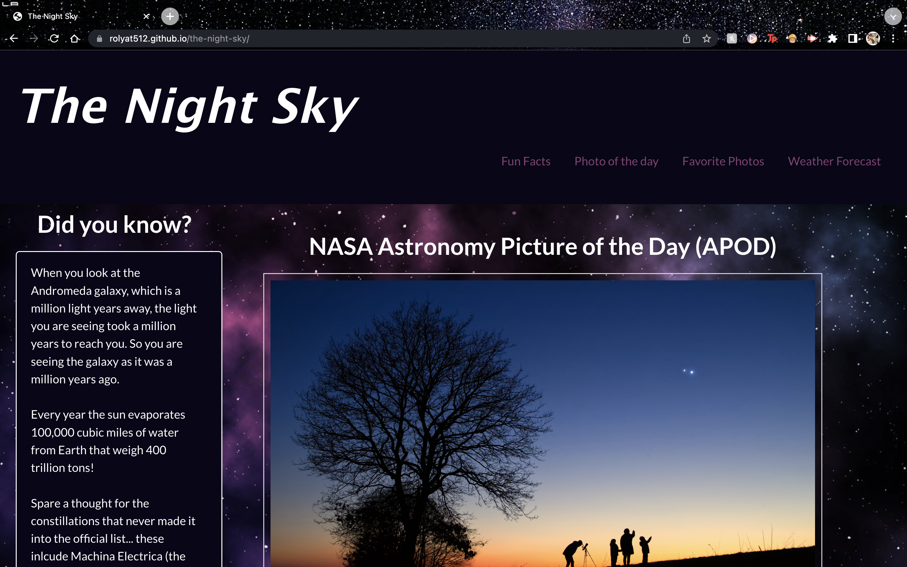
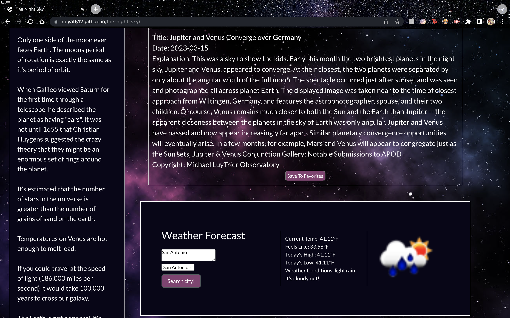
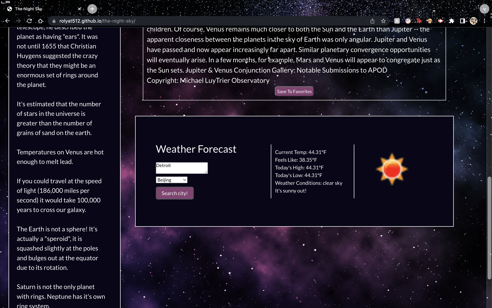

# the-night-sky

## Description

This website allows users to view the NASA Astronomy Photo of the Day as well as check the weather in their area to see if the weather is optimal for stargazing. Along the side are also fun facts about space in order to get users excited and and interested in astronomy.

## Installation

This website can be accessed at https://rolyat512.github.io/the-night-sky/

## Usage

## Credits

### Collaborators

Elizabeth Niño https://github.com/Liz-Nino64

Scott Bossard https://github.com/sjbossa

Patricia Helberg https://github.com/PHelberg

### Copyright

Bulma by Jeremy Thomas. https://github.com/jgthms Source code licensed MIT. Website content licensed CC BY-NC-SA 4.0
Get Bulma at https://bulma.io

NASA Astronomy Photo of the Day API is owned by the National Aeronautics and Space Administration.
Get the NASA Astronomy Picture of the Day at https://github.com/nasa/apod-api

OpenWeather 5-Day Forecast API© 2012 — 2023 OpenWeather ® All rights reserved
Get OpenWeather API at https://openweathermap.org/forecast5

jQuery Copyright 2023 OpenJS Foundation and jQuery contributors.
Get jQuery at https://jquery.com

## License

Licensed under the MIT License
